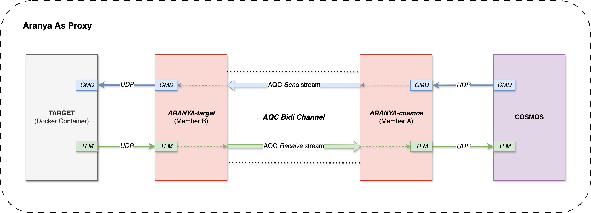

# Aranya Cosmos Proxy Example

An example that demonstrates how to use Aranya as a secure proxy for OpenC3 COSMOS. This example is based on the [multi-node example](https://github.com/aranya-project/aranya/tree/442-example-split-complex-example-into-simple-focused-examples/examples/rust/aranya-example-multi-node) from the original Aranya repository.

## How Aranya is Used as a Proxy

In this example, Aranya creates secure channels between COSMOS and target systems, acting as a cryptographic proxy that:
- Establishes an encrypted communication channel using Aranya QUIC Channels(AQC)
- Provides secure command and telemetry routing between COSMOS and targets
- Ensures only authorized devices can communicate with targets
- Maintains end-to-end encryption for all data transmission

Each Aranya device runs as a stand-alone executable that can be deployed on different machines in the network.

## Architecture Diagram

## Repository Contents

This repository includes:
- **Aranya proxy executables**: Multi-node example adapted for COSMOS integration
- **Docker configuration files**: For running target systems a containerized service
- **COSMOS plugin configuration**: Files that enable COSMOS to communicate with Aranya-protected targets

# How To Run The Example

The example can be run using the bash script provided in this folder.

## Docker Container Deployment

The repository includes Docker configuration files that allow you to run target systems as containerized services, providing an isolated and reproducible environment for testing the Aranya proxy functionality.

## COSMOS Plugin Integration

Configuration files are provided to install the COSMOS plugin that enables COSMOS to communicate with Aranya-protected targets through the secure proxy channels.
